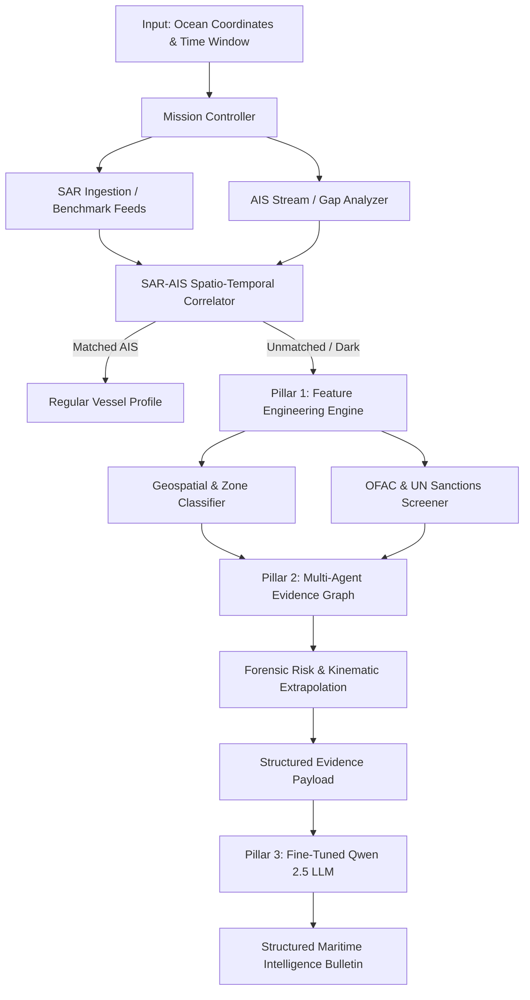

# System Architecture: Maritime Intelligence & Dark Vessel Detection

## 1. Architectural Philosophy & The Three Pillars

The architecture has been designed from the ground up to address the professor's three core evaluation requirements while eliminating the fragility and bloat of the initial concept document.

```
                    ┌────────────────────────────────────────┐
                    │       MULTI-SOURCE RAW INGESTION       │
                    │   SAR Metadata | AIS Tracks | Sanctions│
                    └───────────────────┬────────────────────┘
                                        │
                                        ▼
             ╔═════════════════════════════════════════════════════╗
             ║        PILLAR 1: FEATURE ENGINEERING ENGINE         ║
             ║  SAR Geometry | Kinematics | Geospatial | Fusion    ║
             ╚══════════════════════════┬══════════════════════════╝
                                        │
                                        ▼
             ┌─────────────────────────────────────────────────────┐
             │       STATISTICAL / ML ANALYTIC RISK BASELINE       │
             │   Anomaly Scoring | Kinematic Dead-Reckoning Extrap │
             └──────────────────────────┬──────────────────────────┘
                                        │
                                        ▼
             ╔═════════════════════════════════════════════════════╗
             ║         PILLAR 2: LANGGRAPH AGENTIC WORKFLOW        ║
             ║  Controller ──► Ingestion ──► Geo/Sanctions ──► HITL║
             ║  (Typed Shared State, Tool Calling, Degradation)    ║
             ╚══════════════════════════┬══════════════════════════╝
                                        │
                                        ▼
             ╔═════════════════════════════════════════════════════╗
             ║     PILLAR 3: DOMAIN FINE-TUNED LLM SYNTHESIZER     ║
             ║  Evidence Synthesis | Legal Grounding | Formatting  ║
             ╚══════════════════════════┬══════════════════════════╝
                                        │
                                        ▼
                    ┌────────────────────────────────────────┐
                    │      STRUCTURED INTELLIGENCE REPORT    │
                    │  Threat Tier | Violations | Forecast   │
                    └────────────────────────────────────────┘
```

---

## 2. The Three Core Pillars

### Pillar 1: Feature Engineering (`src/features/`)
Feature engineering is treated as an explicit, first-class mathematical pipeline rather than hidden model internals. Features are organized into five distinct domains:
1.  **SAR Morphology & Radiometry:** Length, beam, aspect ratio, radar footprint area, target-to-clutter ratio (dB), peak backscatter, and polarization variance.
2.  **AIS Kinematics & Transmission Integrity:** Mean SOG, speed variance, turn rate, trajectory curvature, current transmission outage duration, 30-day historical outage count, and loitering hours.
3.  **Geospatial & Sovereignty Context:** Distance to coastline, distance to EEZ boundary, binary sovereign EEZ status, proximity to recognized Ship-to-Ship (STS) transfer corridors, and local traffic density.
4.  **Historical & Registry Indicators:** Prior illicit trade flags, flag-hopping frequency (12-month flag changes), and name modification frequency.
5.  **SAR-AIS Fusion Metrics:** Spatial offset between SAR detection and AIS dead-reckoning extrapolation, temporal difference, length mismatch ratio ($|\Delta L| / L_{AIS}$), heading angular discrepancy, and composite correlation score.

*Every feature has a computable mathematical formula, documented provenance, and flattens into a feature vector (`EngineeredFeatures.to_flat_dict()`) for quantitative ablation and feature importance analysis.*

---

### Pillar 2: Agentic AI Orchestration (`agents/`)
Implemented using **LangGraph**, the agentic system orchestrates multi-source investigation rather than relying on linear scripts:
*   **Typed State Container (`MaritimeAgentState`):** All agents read and write to a strongly typed Pydantic state container.
*   **Specialized Agent Nodes:**
    *   `MissionControllerAgent`: Evaluates query scope and determines which data sources to invoke.
    *   `SARAISCorrelatorAgent`: Executes spatial-temporal correlation and flags dark vessel candidates.
    *   `FeatureEngineeringAgent`: Runs the Pillar 1 feature extraction pipeline across all active detections.
    *   `SanctionsAndRegistryAgent`: Cross-matches candidate identities against OFAC SDN and UN sanctions databases.
    *   `ForensicAssessmentAgent`: Computes quantitative risk scores, kinematic dead-reckoning trajectories, and EEZ incursion alerts.
    *   `IntelligenceReportingAgent`: Formats the fused evidence payload and queries the Fine-Tuned LLM.
*   **Conditional Routing & Graceful Degradation:** If external AIS feeds or specific registries are unreachable or yield null results, conditional edges route execution to safe fallback handlers, appending explanatory notes to `state.degradation_notes` rather than halting the system.
*   **Human-in-the-Loop (HITL):** High-threat detections trigger an interrupt checkpoint before report dissemination.

---

### Pillar 3: Domain Fine-Tuned LLM (`training/` & `src/models/`)
The system decouples radar signal detection from cognitive intelligence analysis:
*   **Base Model Selection:** `Qwen/Qwen2.5-7B-Instruct` (with `Qwen2.5-3B-Instruct` as a low-storage / low-VRAM alternative).
*   **Fine-Tuning Role:** The LLM does NOT calculate distances or radar dimensions (which deterministic Python functions handle with 100% precision). Instead, the fine-tuned LLM specializes in:
    1.  Synthesizing disparate multi-source evidence into coherent executive narratives.
    2.  Grounding findings in precise international maritime law (SOLAS Chapter V, UNCLOS Articles 56 & 73, OFAC executive orders).
    3.  Expressing explicit analytical confidence intervals and sensor limitations.
    4.  Eliminating conversational fluff in favor of standardized intelligence bulletin formats (`MAR-INTEL-XXX`).
*   **Parameter-Efficient Adaptation:** 4-bit QLoRA fine-tuning using Hugging Face `PEFT` and `TRL`, training low-rank adapters (~50 MB) on structured (evidence vector $\rightarrow$ structured report) pairs.

---

## 3. Data Flow Diagram



---

## 4. Resilience & Error Handling Principles

1.  **Strict Local Storage Isolation:** All downloads require pre-validation through `StorageGuard`.
2.  **Zero Hallucinated Facts:** Real-time sanctions hits, distances, and coordinates are computed deterministically and passed in the context window. The LLM is penalized if it generates entities not present in the evidence payload.
3.  **Deterministic Fallbacks:** If GPU acceleration or LLM inference fails, the system provides a template-based heuristic report using the exact same `IntelligenceReport` Pydantic schema.
