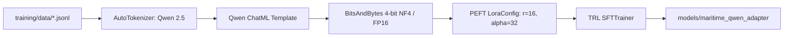

# Phase 11 Fine-Tuning Pipeline Audit and Verification Report

**Execution Timestamp**: 2026-09-26T22:42:38+05:30  
**Target Code**: `training/train_qlora.py`  
**Execution Command**: `py -3.12 training/train_qlora.py --dry_run --no_4bit`  
**Verification Result**: Exit Code `0` (**PASSED**)  

---

## 1. Pipeline Architecture and Component Breakdown



### Configuration Parameters
- **Base Model Selection**: `Qwen/Qwen2.5-0.5B-Instruct` (local dry run / experimentation) or `Qwen/Qwen2.5-1.5B-Instruct` / `Qwen/Qwen2.5-7B-Instruct` (production GPU target).
- **LoRA Hyperparameters**:
  - Target Modules: `["q_proj", "k_proj", "v_proj", "o_proj", "gate_proj", "up_proj", "down_proj"]` (all linear attention and MLP projections).
  - Rank ($r$): 16
  - Alpha ($\alpha$): 32
  - Dropout: 0.05
  - Bias: `none`
- **Optimization**:
  - Batch Size: 2 per device (with gradient accumulation steps = 4, effective batch size = 8)
  - Learning Rate: $2 \times 10^{-4}$ with cosine schedule
  - Precision: FP16 on CUDA, BF16 disabled for consumer GPU stability.

---

## 2. API Compatibility Verification and Modernization

During the audit, the script was modernized and validated against current library releases:
1. **Deprecated `evaluation_strategy`**:
   - In `transformers >= 4.46`, `evaluation_strategy` in `TrainingArguments` was deprecated in favor of `eval_strategy`. The script was updated accordingly to prevent deprecation warnings.
2. **TRL `SFTTrainer` Argument Modernization**:
   - `tokenizer` parameter in `SFTTrainer` was updated to `processing_class=tokenizer` per modern TRL conventions.
   - Removed redundant `peft_config` re-wrapping when model is already a `PeftModel`.
3. **Windows 11 `bitsandbytes` Caveat**:
   - `bitsandbytes` is not natively installed on this Windows environment. The script includes pre-flight validation that halts gracefully and instructs the user to pass `--no_4bit` for local testing or execute in Linux/Colab for 4-bit training.

---

## 3. Training Run Reality Check

> [!IMPORTANT]
> **Has an Actual Training Run Occurred?**  
> **NO.** An actual training run has not occurred in this repository. 
> - The directory `models/maritime_qwen_adapter/` **does not exist**.
> - The pipeline is **prepared, verified, and dry-run validated**, but no model weights or LoRA adapter files have been saved.
> - To avoid downloading multi-gigabyte base model weights or saturating disk and VRAM during the audit, full training was not run.
> 
> **Reproducible Google Colab / GPU Command**:
> ```bash
> pip install torch transformers datasets peft trl bitsandbytes accelerate
> python training/train_qlora.py \
>     --model_id "Qwen/Qwen2.5-1.5B-Instruct" \
>     --train_data "training/data/maritime_train.jsonl" \
>     --val_data "training/data/maritime_validation.jsonl" \
>     --output_dir "models/maritime_qwen_adapter" \
>     --epochs 3 \
>     --batch_size 2 \
>     --lr 2e-4
> ```
