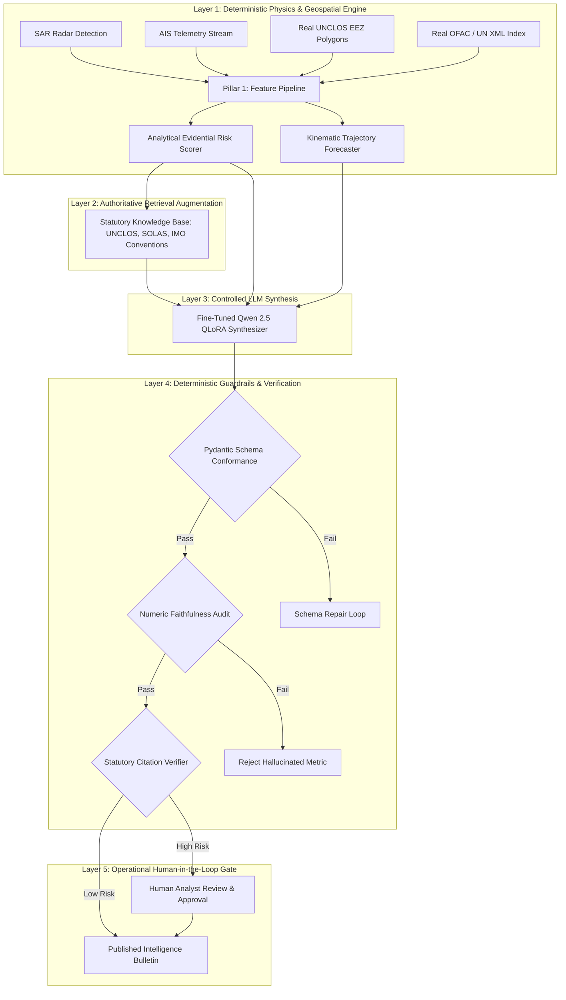

# Phase 12 LLM Role and System Architecture Design

**Document Purpose**: Definitive technical specification and boundaries for integrating Large Language Models (LLMs) into maritime surveillance systems.  
**Core Architectural Mandate**: **The LLM must NEVER compute numerical kinematic measurements, radar backscatter statistics, spatial distances, or legal verdicts directly from raw inputs.** Deterministic code must perform all mathematical, spatial, and relational operations; the LLM is restricted to evidence synthesis, structured explanation, and natural language communication.

---

## 1. Specification of 15 Proposed LLM Roles

| # | Role Description | Input Data | Output Specification | Tools Available | Retrieval Required? | Deterministic Validation? | Hallucination Risk | Human Approval Required? | Primary Evaluation Metric |
| :-: | :--- | :--- | :--- | :--- | :---: | :---: | :---: | :---: | :--- |
| **01** | **Structured Intelligence Bulletin Generation** | Validated `EngineeredFeatures`, `RiskAssessment`, `GeoContext` | Structured JSON matching `IntelligenceReport` | None (Purity) | No | **Yes** (Pydantic Schema) | Medium | Yes (High-Risk) | Schema validity rate, field completeness |
| **02** | **Evidence-Grounded Score Explanation** | Quantitative risk breakdown, feature deltas | Natural language narrative explaining *why* the score triggered | None | No | **Yes** (Numeric Faithfulness) | Low | No | Evidence grounding score, numeric match |
| **03** | **Uncertainty & Limitation Explanation** | Sensor SNR, AIS gap duration, weather clutter | Explicit caveat section detailing observation limits | None | No | **Yes** (Coverage Check) | Low | No | Limitation coverage rate |
| **04** | **Statutory Retrieval & Citation Formatting** | Target violation flags (e.g. UNCLOS 73, SOLAS V/19) | Exact statutory quotations and jurisdictional citations | Vector search over UNCLOS/SOLAS corpus | **Yes** | **Yes** (Exact String Verification) | Low | Yes | Citation precision and recall |
| **05** | **Analyst Q&A over Evidence Graph** | Operator natural language prompt, Mission State | Grounded conversational response | Graph query tool, Cypher / SQL | **Yes** | **Yes** (Answer Guardrail) | Medium | No | Factuality / Groundedness score |
| **06** | **Query-to-Tool Translation** | Free-text analyst mission query | Parameterized `Mission` schema object | Pydantic schema generator | No | **Yes** (JSON Schema / BBox bounds) | Low | No | Tool invocation accuracy |
| **07** | **Investigation-Plan Generation** | High-risk target state, patrol assets | Recommended follow-up steps (e.g. UAV dispatch) | Asset availability registry | **Yes** | **Yes** (Feasibility Validator) | Medium | **Yes** | Action feasibility score |
| **08** | **Case Prioritization Explanation** | Multi-target queue scores | Ranked justification explaining triage priority | Sorting tool | No | **Yes** (Rank Monotonicity) | Low | No | Rank alignment accuracy |
| **09** | **Similar Historical Case Retrieval** | Active feature vector | Summaries of past adjudicated illicit transits | Vector DB (cosine similarity over embeddings) | **Yes** | **Yes** (Metadata Cross-check) | Medium | No | Mean reciprocal rank (MRR) |
| **10** | **Counterfactual Explanations** | State + perturbation (e.g. "What if outage were 2h?") | Delta explanation based on re-evaluated deterministic score | Sandbox risk scorer re-run tool | No | **Yes** (Re-score Verification) | Low | No | Counterfactual correctness |
| **11** | **Analyst Report Co-Editing** | Draft bulletin + analyst redlines | Revised structured intelligence bulletin | Diff editor | No | **Yes** (Constraint Validator) | Low | **Yes** | Edit fidelity, syntax retention |
| **12** | **Active Learning Example Curation** | Ambiguous classification records ($0.45 < p < 0.55$) | Formatted query asking domain expert for gold label | Sampling filter | No | **Yes** (Confidence Boundary) | Low | **Yes** | Ambiguity reduction rate |
| **13** | **Structured JSON from Field Notes** | Free-text patrol log or radio intercept | Typed `ObservationUpdate` JSON | Regex / Entity extractor | No | **Yes** (Schema & Coordinate Parser) | High | **Yes** | Entity extraction F1-score |
| **14** | **Multi-Language Report Localization** | English `IntelligenceReport` | Verified maritime bulletin in Hindi, Arabic, or French | Terminology lexicon | No | **Yes** (Bilingual Terminology Check) | Medium | Yes | BLEU / COMET / Domain fidelity |
| **15** | **Red-Team Claim Verifier** | Candidate draft report + evidence vector | List of claims in text lacking underlying sensor proof | Assertion matcher | No | **Yes** (Unsupported-claim detector) | Low | No | Unsupported claim catch rate |

---

## 2. Final Recommended System Architecture

### Architectural Guarantees:
1. **Mathematical Invariance**: All speeds, distances, areas, and risk indices originate in Layer 1; the LLM is prohibited from altering numeric values.
2. **Schema Enforcement**: All LLM outputs must parse strictly into Pydantic models before ingestion by operational networks.
3. **Citation Guard**: Any statutory claim must resolve to an exact verified article in the retrieved legal index.
4. **Human Command**: Lethal or sovereign interdiction alerts (threat tier `HIGH` or `SEVERE`) mandate human operator sign-off at Layer 5.
